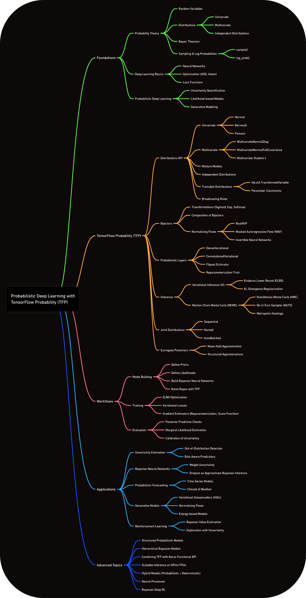

# 🧠 **Probabilistic Deep Learning with TensorFlow**

<div align="center">

[](https://github.com/mohd-faizy)
[](https://tensorflow.org/)
[](https://www.tensorflow.org/probability)
[](https://jupyter.org/)
[](https://github.com/mohd-faizy/Probabilistic-Deep-Learning-with-TensorFlow)
[](https://github.com/mohd-faizy/Probabilistic-Deep-Learning-with-TensorFlow)
[](https://github.com/mohd-faizy/07T_Probabilistic-Deep-Learning-with-TensorFlow/issues)
[](https://github.com/mohd-faizy/Probabilistic-Deep-Learning-with-TensorFlow)
[](https://github.com/mohd-faizy/Probabilistic-Deep-Learning-with-TensorFlow/blob/master/LICENSE)
[](https://github.com/mohd-faizy/07T_Probabilistic-Deep-Learning-with-TensorFlow)
[](https://github.com/mohd-faizy/Probabilistic-Deep-Learning-with-TensorFlow)


</div>


This repository is a comprehensive collection of **TensorFlow Probability** implementations for probabilistic deep learning. The *primary* goal is **educational**: to bridge the gap between traditional deterministic models and real-world uncertainty quantification. 


✨**Unlock the power of uncertainty quantification in machine learning.** 

This repository provides hands-on implementations of probabilistic deep learning using TensorFlow Probability (TFP), enabling you to build models that not only make predictions but also quantify how confident they are about those predictions.

> **Documentation**: [TFP API Docs](https://www.tensorflow.org/probability/api_docs/python/tfp)


## 🎯 Overview


### What Makes This Repository Special?

Traditional machine learning models provide point estimates without quantifying uncertainty. In critical applications like medical diagnosis, autonomous vehicles, or financial modeling, **knowing how confident your model is** can be the difference between success and catastrophic failure.

- Enables models to express confidence levels using probabilistic layers and Bayesian neural networks.

- Supports sampling, log-likelihood evaluation, and manipulation of complex distributions (univariate & multivariate).

- Powers VAEs and normalizing flows for density estimation, representation learning, and synthetic data generation.

This repository demonstrates how **TensorFlow Probability** transforms your standard neural networks into probabilistic powerhouses that:

- **Quantify uncertainty** in predictions
- **Model complex distributions** beyond simple Gaussian assumptions  
- **Perform Bayesian inference** at scale
- **Generate realistic synthetic data** through advanced generative models


### Why Probabilistic Deep Learning Matters

<p align="center">
  <a href="https://youtu.be/BrwKURU-wpk?si=S0xhuUHoiYGaorcE" target="_blank">
    
  </a>
</p>


Real-world data is messy, incomplete, and uncertain. Probabilistic deep learning addresses these challenges by:

- **Handling Data Scarcity**: Bayesian approaches work well with limited data.
- **Robust Decision Making**: Uncertainty estimates guide better decisions.
- **Interpretable AI**: Understanding model confidence builds trust
- **Anomaly Detection**: Identifying outliers and unusual patterns.
- **Risk Assessment**: Quantifying potential failure modes.


#### ⚙️**Technical Strengths**
- Bayesian neural networks: Adds priors to weights and calibrates predictive uncertainty for out-of-distribution robustness.

- Normalizing flows: Uses invertible transforms for expressive density estimation and efficient sampling.

- Variational inference: Optimizes ELBO with reparameterization for controllable generation and learning.

#### 🚀**Trade-offs & Performance**
- Higher memory and training time than deterministic models.
- Gains in interpretability, calibrated risk, and anomaly detection often outweigh the cost


---

## 🔧 Prerequisites

### Mathematical Background
- **Linear Algebra**: Matrix operations, eigenvalues, SVD
- **Calculus**: Derivatives, gradients, optimization
- **Statistics**: Probability theory, Bayes' theorem, distributions
- **Information Theory**: KL divergence, entropy, mutual information

### Programming Skills
- **Python 3.8+** with object-oriented programming
- **TensorFlow/Keras** fundamentals
- **NumPy/SciPy** for numerical computing
- **Matplotlib/Seaborn** for visualization

### Recommended Reading
- [Pattern Recognition and Machine Learning](https://www.microsoft.com/en-us/research/people/cmbishop/#!prml-book) by Christopher Bishop
- [The Elements of Statistical Learning](https://web.stanford.edu/~hastie/ElemStatLearn/) by Hastie, Tibshirani, and Friedman
- [Probabilistic Machine Learning](https://probml.github.io/pml-book/) by Kevin Murphy

---


## 🚀 Quick Start

1. **Clone the repository:**
   ```bash
   git clone https://github.com/mohd-faizy/Probabilistic-Deep-Learning-with-TensorFlow.git
   cd Probabilistic-Deep-Learning-with-TensorFlow
    ```

2. **Create virtual environment (using [uv](https://github.com/astral-sh/uv) – ⚡ faster alternative):**

   ```bash
   # Install uv if not already installed
   pip install uv

   # Create and activate virtual environment
   uv venv

   # Activate the env
   source .venv/bin/activate   # Linux/macOS
   .venv\Scripts\activate      # Windows
   ```

3. **Install dependencies:**

   ```bash
   uv add -r requirements.txt
   ```

4. **Verify installation:**

   ```python
   import tensorflow as tf
   import tensorflow_probability as tfp

   print(f"TensorFlow: {tf.__version__}")
   print(f"TensorFlow Probability: {tfp.__version__}")
   ```

---

### ⚡ Quick Example

```python
import tensorflow as tf
import tensorflow_probability as tfp

tfd = tfp.distributions

# Create a probabilistic model
def create_bayesian_model():
    model = tf.keras.Sequential([
        tfp.layers.DenseVariational(
            units=64,
            make_prior_fn=lambda: tfd.Normal(0., 1.),
            make_posterior_fn=tfp.layers.default_mean_field_normal_fn(),
            kl_weight=1/50000
        ),
        tf.keras.layers.Dense(10, activation='softmax')
    ])
    return model

# Train with uncertainty quantification
model = create_bayesian_model()
model.compile(optimizer='adam', loss='sparse_categorical_crossentropy')
```


---

## 🎲 Core Probability Distributions

Understanding these distributions is crucial for effective probabilistic modeling:

---

### 📊 Discrete Distributions

#### **Binomial Distribution**  

Models the number of successes in \(n\) independent trials with probability \(p\).

$$
P(X = k) = \binom{n}{k} p^k (1-p)^{n-k}
$$

**Use Cases**: A/B testing, quality control, medical trials  

---

#### **Poisson Distribution**  

Models the number of events occurring in a fixed interval.

$$
P(X = k) = \frac{\lambda^k e^{-\lambda}}{k!}
$$

**Use Cases**: Customer arrivals, system failures, web traffic  

---

### 📈 Continuous Distributions

#### **Gaussian (Normal) Distribution**  

The cornerstone of probabilistic modeling with symmetric, bell-shaped curves.

$$
f(x) = \frac{1}{\sigma\sqrt{2\pi}} \exp\left(-\frac{(x-\mu)^2}{2\sigma^2}\right)
$$

**Use Cases**: Neural network weights, measurement errors, natural phenomena  

---

#### **Exponential Distribution**  

Models waiting times and survival analysis.

$$
f(x) = \lambda e^{-\lambda x}, \quad x \geq 0
$$

**Use Cases**: System reliability, queueing theory, survival analysis  

---

### 🌐 Multivariate Distributions

#### **Multivariate Gaussian**  

Essential for modeling correlated variables with full covariance structure.

$$
f(\mathbf{x}) = \frac{1}{\sqrt{(2\pi)^k|\boldsymbol{\Sigma}|}}
\exp\left(-\frac{1}{2}(\mathbf{x}-\boldsymbol{\mu})^T\boldsymbol{\Sigma}^{-1}(\mathbf{x}-\boldsymbol{\mu})\right)
$$

**Use Cases**: Dimensionality reduction, portfolio optimization, computer vision  


---

## 🧪 Hands-On Examples

### Comprehensive Notebook Collection

| # | Topic | Difficulty | Key Concepts | Notebook |
|---|-------|------------|--------------|----------|
| 00 | Univariate Distributions | 🟢 Beginner | Normal, Exponential, Beta distributions | [](01_The%20TensorFlow_Probability_library/00_Univariate_Distributions.ipynb) |
| 01 | Multivariate Distributions | 🟡 Intermediate | MultivariateNormal, covariance structure | [](01_The%20TensorFlow_Probability_library/01_MultiVariate_Distributions.ipynb) |
| 02 | Independent Distributions | 🟡 Intermediate | tfd.Independent, batch dimensions | [](01_The%20TensorFlow_Probability_library/02_Independent_Distributions.ipynb) |
| 03 | Sampling & Log Probabilities | 🟡 Intermediate | `sample()`, `log_prob()`, Monte Carlo | [](01_The%20TensorFlow_Probability_library/03_Sampling%20and%20Log%20Probabilities.ipynb) |
| 04 | Trainable Distributions | 🟡 Intermediate | tf.Variable parameters, gradient flow | [](01_The%20TensorFlow_Probability_library/04_Trainable_Distributions.ipynb) |
| 05 | TFP Distributions Summary | 🟢 Reference | Distribution catalog, API reference | [](01_The%20TensorFlow_Probability_library/05_tfp_Distributions_Summary_.ipynb) |
| 06 | Independent Naive Classifier | 🟡 Intermediate | Feature independence, text classification | [](01_The%20TensorFlow_Probability_library/06_Independent_dist_Naive_Clasif.ipynb) |
| 07 | Naive Bayes with TFP | 🟡 Intermediate | Bayes' theorem, posterior computation | [](01_The%20TensorFlow_Probability_library/07_Naive_Bayes_Classif_with_TFP.ipynb) |
| 08 | Multivariate Gaussian Full Covariance | 🔴 Advanced | Full covariance, correlation modeling | [](01_The%20TensorFlow_Probability_library/08_Multivariate_Gaussian_with_full_covariance.ipynb) |
| 09 | Broadcasting Rules | 🟡 Intermediate | Shape manipulation, batch processing | [](01_The%20TensorFlow_Probability_library/09_Broadcasting_rules.ipynb) |
| 10 | Naive Bayes & Logistic Regression | 🟡 Intermediate | Generative vs discriminative models | [](01_The%20TensorFlow_Probability_library/10_Naive_Bayes_%26_logistic_regression.ipynb) |
| 11 | Probabilistic Layers & Bayesian NNs | 🔴 Advanced | DenseVariational, weight uncertainty, captured epistemic/aleatoric risk | [](02_Probabilistic_layers_and_Bayesian_Neural_Networks/Probabilistic_layers_and_Bayesian_Neural_Networks.ipynb) |
| 12 | Bijectors & Normalizing Flows | 🔴 Advanced | tfp.bijectors, invertible transforms, RealNVP, coupling layers | [](03_Bijectors_and_Normalising_Flows/Bijectors_and_Normalising_Flows.ipynb) |
| 13 | Variational Autoencoders | 🔴 Advanced | ELBO, reparameterization trick, celebrity face generation | [](04_Variational_Autoencoders/Variational_Autoencoders.ipynb) |
| 14 | Introduction to MCMC | 🔴 Advanced | Sampling problems, Metropolis-Hastings from scratch | [](05_MCMC_and_Hamiltonian_Monte_Carlo/00_Introduction_to_MCMC.ipynb) |
| 15 | Hamiltonian Monte Carlo | 🔴 Advanced | Hamiltonian dynamics, leapfrog integration, HMC in TFP | [](05_MCMC_and_Hamiltonian_Monte_Carlo/01_Hamiltonian_Monte_Carlo.ipynb) |
| 16 | Bayesian Model Comparison | 🔴 Advanced | Marginal likelihood, Bayes factors estimation via MCMC | [](05_MCMC_and_Hamiltonian_Monte_Carlo/02_Bayesian_Model_Comparison.ipynb) |
| 17 | Hierarchical Bayesian Models | 🔴 Advanced | Joint distributions, pooling strategies, TFP joint distribution APIs | [](05_MCMC_and_Hamiltonian_Monte_Carlo/03_Hierarchical_Bayesian_Models.ipynb) |
| 18 | Gaussian Mixture Models | 🟡 Intermediate | MixtureSameFamily, 1D/2D mixtures, sampling & density evaluation | [](06_Mixture_Models_and_EM_Algorithm/00_Gaussian_Mixture_Models.ipynb) |
| 19 | Expectation Maximization (EM) | 🔴 Advanced | Latent variables, ELBO derivation, GMM EM from scratch | [](06_Mixture_Models_and_EM_Algorithm/01_Expectation_Maximization_Deep_Dive.ipynb) |
| 20 | Bayesian Mixture Models | 🔴 Advanced | Dirichlet-Multinomial mixtures, fully Bayesian GMMs with MCMC | [](06_Mixture_Models_and_EM_Algorithm/02_Bayesian_Mixture_Models_with_MCMC.ipynb) |
| 21 | Introduction to Gaussian Processes | 🔴 Advanced | Distributions over functions, RBF/periodic kernels, GP prior sampling | [](07_Gaussian_Processes/00_Introduction_to_Gaussian_Processes.ipynb) |
| 22 | GP Classification & Kernels | 🔴 Advanced | Bernoulli likelihood, kernel engineering/arithmetic, latent GP classification | [](07_Gaussian_Processes/01_GP_Classification_and_Kernels.ipynb) |
| 23 | Sparse & Scalable GPs | 🔴 Expert | Inducing variables, Variational Sparse GP (VSGP) optimization | [](07_Gaussian_Processes/02_Sparse_and_Scalable_GPs.ipynb) |
| 24 | Structural Time Series Models | 🟡 Intermediate | State-space models, local linear trend, seasonality components, tfp.sts | [](08_Probabilistic_Time_Series/00_Structural_Time_Series_Models.ipynb) |
| 25 | Bayesian Time Series Forecasting | 🔴 Advanced | Multiple seasonalities, regression, spike-and-slab variable selection | [](08_Probabilistic_Time_Series/01_Bayesian_Time_Series_Forecasting.ipynb) |
| 26 | Deep Probabilistic Time Series | 🔴 Advanced | Probabilistic LSTMs, Negative Log-Likelihood (NLL) loss, seq-to-seq uncertainty | [](08_Probabilistic_Time_Series/02_Deep_Probabilistic_Time_Series.ipynb) |
| 27 | Capstone: Bayesian Medical Diagnosis | 🔴 Expert | Clinical decision support, BNN for diagnosis, KL weight regularization | [](09_Capstone_Bayesian_Medical_Diagnosis/00_Bayesian_Medical_Diagnosis.ipynb) |
| 28 | Capstone: Probabilistic Forecasting | 🔴 Expert | Synthetic market data, BSTS, Value at Risk (VaR), risk quantification | [](10_Capstone_Probabilistic_Forecasting/00_Probabilistic_Financial_Forecasting.ipynb) |
| 29 | Capstone: Probabilistic Generative Models | 🔴 Expert | Normalizing flow dataset creation, VAE, latent space interpolation | [](11_Capstone_Probabilistic_generative_models/Probabilistic_generative_models.ipynb) |

---


## 📊 Performance Benchmarks

### Training Time Comparison

| Model Type | Dataset | Standard NN | Bayesian NN | VAE | Normalizing Flow |
|------------|---------|-------------|-------------|-----|------------------|
| MNIST Classification | 60k samples | 2 min | 8 min | 12 min | 15 min |
| CIFAR-10 Classification | 50k samples | 15 min | 45 min | 60 min | 90 min |
| CelebA Generation | 200k samples | N/A | N/A | 120 min | 180 min |

>*Benchmarks on NVIDIA RTX 3090 GPU*

### Memory Usage

Probabilistic models typically require **2-4x more memory** than standard models due to:
- Parameter uncertainty representation
- Additional forward/backward passes
- Sampling operations during training

---

## 🎯 TensorFlow Probability vs TensorFlow Core

| **Aspect** | **TensorFlow Probability (TFP)** | **TensorFlow Core (TF)** |
|------------|-----------------------------------|--------------------------|
| **Primary Focus** | Probabilistic modeling, uncertainty quantification | Deterministic neural networks, optimization |
| **Model Output** | Distributions with uncertainty bounds | Point estimates |
| **Key Strengths** | Bayesian inference, generative modeling | Fast training, established workflows |
| **Learning Curve** | Steeper (requires probability theory) | Gentler (standard ML concepts) |
| **Memory Usage** | Higher (parameter distributions) | Lower (point parameters) |
| **Training Time** | Slower (sampling, variational inference) | Faster (direct optimization) |
| **Interpretability** | Higher (uncertainty quantification) | Lower (black box predictions) |
| **Best Use Cases** | Critical decisions, small data, research | Large datasets, production systems |

---

## 🤝 Contributing

We welcome contributions from the community! Here's how you can help:

### Contribution Process
1. **Fork** the repository
2. **Create** a feature branch (`git checkout -b feature/amazing-feature`)
3. **Commit** your changes (`git commit -m 'Add amazing feature'`)
4. **Push** to the branch (`git push origin feature/amazing-feature`)
5. **Open** a Pull Request

---

## 📚 Additional Resources

### Reference Materials
- [Probability Cheatsheet A](CheatSheet/01_Probability_Cheatsheet_a.pdf)
- [Probability Cheatsheet B](CheatSheet/02_Probability_Cheatsheet_b.pdf)
- [TensorFlow Probability Official Guide](https://www.tensorflow.org/probability)

### Research Papers

#### Foundational Papers
- [Auto-Encoding Variational Bayes](https://arxiv.org/abs/1312.6114) - Kingma & Welling (2013)
- [Stochastic Backpropagation and Approximate Inference in Deep Generative Models](https://arxiv.org/abs/1401.4082) - Rezende et al. (2014)
- [Weight Uncertainty in Neural Networks](https://arxiv.org/abs/1505.05424) - Blundell et al. (2015)
- [Variational Inference: A Review for Statisticians](https://arxiv.org/abs/1601.00670) - Blei et al. (2017)
- [Probabilistic Machine Learning and Artificial Intelligence](https://www.nature.com/articles/nature14541) - Ghahramani (2015)

#### Normalizing Flows & Bijectors
- [Normalizing Flows for Probabilistic Modeling and Inference](https://arxiv.org/abs/1912.02762) - Papamakarios et al. (2019)
- [Density estimation using Real NVP](https://arxiv.org/abs/1605.08803) - Dinh et al. (2016)
- [Glow: Generative Flow with Invertible 1x1 Convolutions](https://arxiv.org/abs/1807.03039) - Kingma & Dhariwal (2018)

#### Bayesian Neural Networks
- [Practical Variational Inference for Neural Networks](https://papers.nips.cc/paper/4329-practical-variational-inference-for-neural-networks) - Graves (2011)
- [What Uncertainties Do We Need in Bayesian Deep Learning for Computer Vision?](https://arxiv.org/abs/1703.04977) - Kendall & Gal (2017)
- [Simple and Scalable Predictive Uncertainty Estimation using Deep Ensembles](https://arxiv.org/abs/1612.01474) - Lakshminarayanan et al. (2017)

#### Variational Inference & MCMC
- [Black Box Variational Inference](https://arxiv.org/abs/1401.0118) - Ranganath et al. (2014)
- [Automatic Differentiation Variational Inference](https://arxiv.org/abs/1603.00788) - Kucukelbir et al. (2017)
- [The No-U-Turn Sampler: Adaptively Setting Path Lengths in Hamiltonian Monte Carlo](https://arxiv.org/abs/1111.4246) - Hoffman & Gelman (2014)

#### Gaussian Processes
- [Gaussian Processes for Machine Learning](http://www.gaussianprocess.org/gpml/) - Rasmussen & Williams (2006)
- [Variational Learning of Inducing Variables in Sparse Gaussian Processes](http://proceedings.mlr.press/v5/titsias09a.html) - Titsias (2009)

#### Probabilistic Time Series Forecasting
- [Predicting the Present with Bayesian Structural Time Series](https://people.ischool.berkeley.edu/~hal/Papers/2013/pred-present-with-bsts.pdf) - Scott & Varian (2014)
- [Deep State Space Models for Time Series Forecasting](https://papers.nips.cc/paper/7818-deep-state-space-models-for-time-series-forecasting) - Rangapuram et al. (2018)

#### TensorFlow Probability Specific
- [TensorFlow Distributions](https://arxiv.org/abs/1711.10604) - Dillon et al. (2017)
- [Probabilistic Programming and Bayesian Methods for Hackers](https://github.com/CamDavidsonPilon/Probabilistic-Programming-and-Bayesian-Methods-for-Hackers) - Davidson-Pilon (2015)

#### Applications & Case Studies
- [Leveraging Heteroscedastic Aleatoric Uncertainties for Robust Real-Time LiDAR 3D Object Detection](https://arxiv.org/abs/2002.05796) - Chang et al. (2020)
- [Predictive Uncertainty Estimation via Prior Networks](https://arxiv.org/abs/1909.00218) - Malinin & Gales (2018)


---

## ⚖️ License

This project is licensed under the MIT License - see the [LICENSE](LICENSE) file for details

---

## 🔗 Connect with me

<div align="center">

[](https://twitter.com/F4izy)
[](https://www.linkedin.com/in/mohd-faizy/)
[](https://ai.stackexchange.com/users/36737/faizy)
[](https://github.com/mohd-faizy)

</div>
